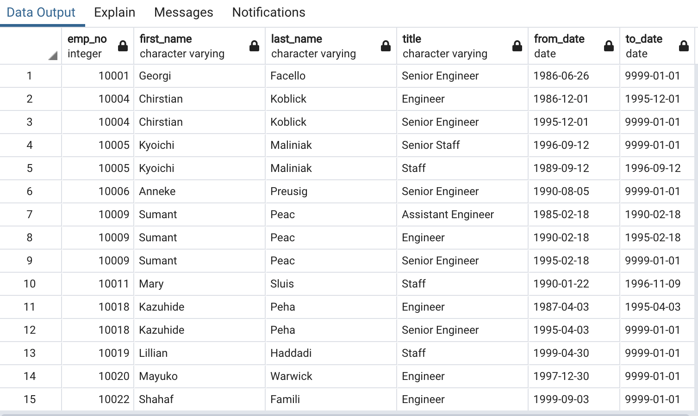
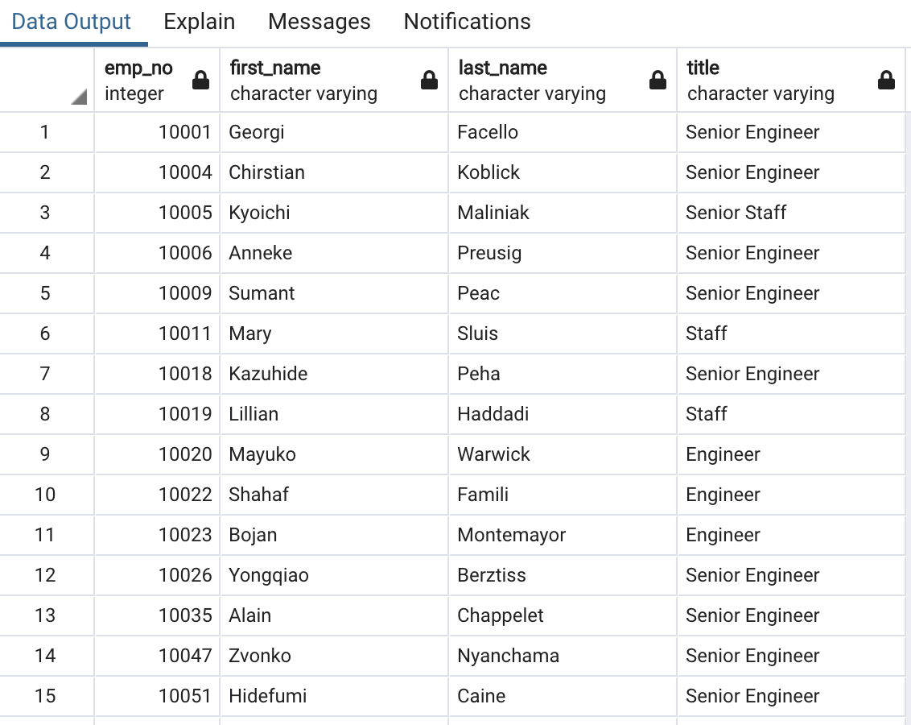
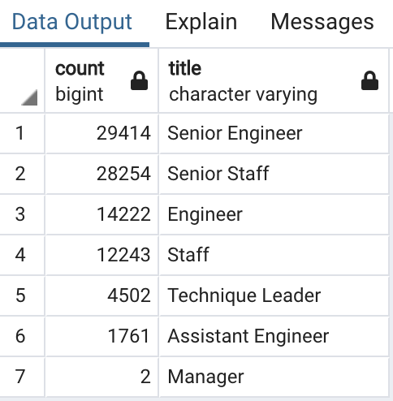

# Pewlett Hackard Analysis

## Overview of the analysis

The purpose of this analysis is to evaluate how many people will be retireing.  Then, identify them for a potential new mentorship program. And establish a pipeline for institutional knowledge to be passed on to other employees.  

## Results
The following two table shows the titles and the names of all the employees that will be eligible for retirment

 

 - One can see employees that have been with the company for numerous years
 - One can also see each employees' advancment with this company

 - This table shows the highest position held by each employee
 - This does not address if they are still with the company

## Summary

We have gathered a lot of information and synthisized it in a manner that can be easily digested and understood.  Overall, we have taken a good first step in understanding our company dynamics and how many employees we have hired throughout the years.  

Their is still more research that is needed to make any further determinations for the future health of the company.  The current data that is available is insufficent to determine who, of these retiring employees, still works for the company and if they are interested in mentorship.  

- This table shows the number of people retiring per each job title
- This is a lot of employees

- This table shows the employees that are eligible for a mentorship program
- It does not address if they are interested in mentoring a new employee nor if there are enough qualified employees to fill those vacancies.  

## Proposal

We can address the deficencies in the data by creating two more queries and gathering more specific questions. The queries that we would be addressing are:

1) Who and how many retiring employees are interested in a mentorship program?
2) What is the current number of employees and what are their titles?

The information to be gathered would include:
1) An addtional database that holds employee information as they leave the company before retirement
2) A database of reasons why people are leaving this company, other than retirment

